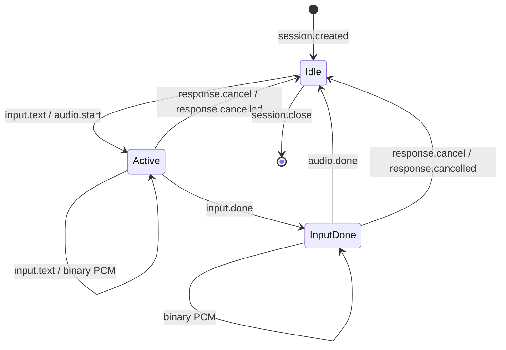
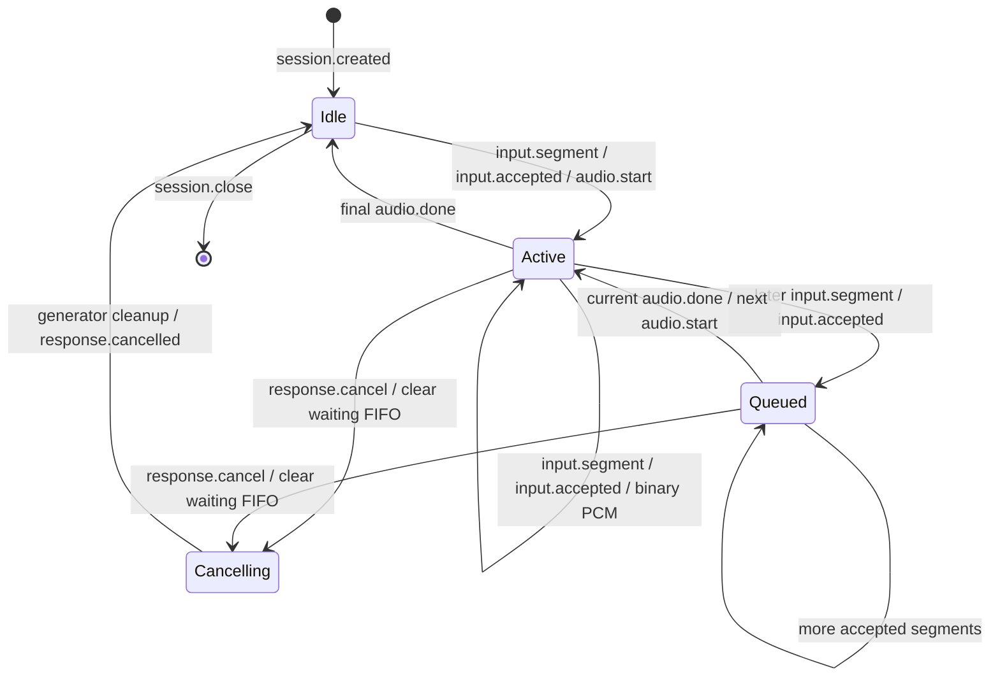

# TTS WebSocket 契约

公开地址为 `wss://{gpu_host}:8443/tts/v1/realtime`。CPU Web 后端在握手头中发送
`Authorization: Bearer <GPU_API_KEY>`；key 不得放入 URL、查询参数或浏览器。网关验证统一公开
key 后，用 TTS 内部 key 访问 `127.0.0.1:8004/realtime`，不会把公开 key 转发到算法服务。
成功握手为 HTTP 101；错误公开 key 返回 401，已有连接占用唯一并发槽时返回 429。服务重启时
新握手可能返回 502 或 504；客户端应等待健康恢复后为后续新回复重新连接。

网关默认将该路径映射到独立的 `tts_300m_service`。原 `tts_service` 的 CosyVoice3 保留为可选
部署；运维显式更改上游时仍使用同一路径。连接不能动态选择或切换模型：

| `session.created.model` | 固定音色 | PCM |
| --- | --- | --- |
| `fun-cosyvoice3-0.5b-2512` | `aishell3-female` | 24000 Hz、单声道、little-endian `pcm_s16le` |
| `cosyvoice-300m-instruct` | `中文女` | 22050 Hz、单声道、little-endian `pcm_s16le` |

客户端不能传模型、音色、参考音频、指令或速度。CosyVoice3 的固定参考音色来自 AISHELL-3
Apache-2.0 女声 SSB0005；300M 固定使用 `中文女`、英文 instruction
`Speak in a natural, clear, and neutral tone.` 和随机种子 42。300M 在分段前对阿拉伯数字执行
中文文本规范化；日期、金额、小数和百分比等按上下文展开，纯数字或英文混合文本也不会进入
英文数字读法。

## 公共握手和帧

连接建立后，服务端首先发送 JSON 文本帧。以下是 300M 示例；CosyVoice3 返回上表对应值：

```json
{
  "type": "session.created",
  "session_id": "tts_0123456789abcdef01234567",
  "model": "cosyvoice-300m-instruct",
  "voice": "中文女",
  "audio": {
    "format": "pcm_s16le",
    "sample_rate_hz": 22050,
    "channels": 1
  }
}
```

客户端必须根据 `model` 选择下述输入协议，并根据 `audio` 初始化音频处理，不能硬编码采样率。
初始事件不声明输入模式。收到其他首帧、二进制首帧、不支持的模型或不匹配的音频元数据时，
客户端应关闭连接。

客户端控制事件均为 UTF-8 JSON 文本帧，且对象不能带未定义字段。音频使用二进制帧；帧边界
没有声学或播放器层面的业务含义，应把同一 ID 的帧作为连续 PCM 字节流处理。所有服务端控制帧
和二进制帧通过同一串行写入路径发出。

两个后端空闲时都接受：

```json
{"type":"session.close"}
```

服务端以 WebSocket close code 1000 关闭。存在活动 utterance、活动 segment 或等待队列时返回
非致命 `invalid_state`。连接断开、服务重启或致命错误时，内存状态不持久化；客户端应把没有
收到成功结束事件的工作视为失败，不自动重放可能已经播放过一部分的内容。

## CosyVoice3 增量协议

CosyVoice3 接受逐步生成的文本：

```json
{"type":"input.text","text":"欢迎使用，"}
{"type":"input.text","text":"正在生成语音。"}
{"type":"input.done"}
```

首个 `input.text` 在空闲连接上创建 utterance，服务端随即发送：

```json
{"type":"audio.start","utterance_id":"utt_0123456789abcdef01234567"}
```

服务端可以在 `input.done` 前开始返回二进制 PCM，因此客户端必须同时发送文本和接收音频。
`input.done` 结束当前文本生成器，但不关闭 WebSocket。模型完成且输入已结束后返回：

```json
{"type":"audio.done","utterance_id":"utt_0123456789abcdef01234567"}
```

`audio.done` 是成功结束的唯一标志。之后同一连接可发送下一条 `input.text`，服务端会分配新 ID。
CosyVoice3 不接受 `input.segment`，返回非致命 `unsupported_event`。

文本块去除首尾空白后必须非空，不能包含 NUL、`<|` 或 `<endofprompt>`。单块最多 1024 个
Unicode 字符，一个 utterance 合计最多 4096 个字符；文本桥接队列最多 16 块，写入等待上限
30 秒。活动 utterance 等待后续文本最多 300 秒。

活动 utterance 可在 `input.done` 前后取消：

```json
{"type":"response.cancel","utterance_id":"utt_0123456789abcdef01234567"}
```

ID 必须等于当前 `audio.start` 的 `utterance_id`。服务端停止接受该 utterance 的文本、停止下发
后续 PCM，并排空厂商生成器；已经进入 GPU 的单次计算不能抢占。清理完成后返回：

```json
{"type":"response.cancelled","utterance_id":"utt_0123456789abcdef01234567"}
```

被取消的 utterance 不再发送 `audio.done`。错误 ID 返回非致命 `invalid_utterance` 且当前任务
继续；没有活动 utterance 时返回非致命 `invalid_state`。收到取消确认后连接回到空闲状态。



## CosyVoice-300M-Instruct 分段 FIFO 协议

CPU 每得到一个完整分段就发送：

```json
{"type":"input.segment","segment_id":"seg-001","text":"这是已经断好的一句话。"}
```

`segment_id` 必须是非空字符串。文本必须非空，不能包含 NUL、`<|` 或 `<endofprompt>`，单段
原始文本最多 2000 个 Unicode 字符。300M 不接受 `input.text` 或 `input.done`，返回非致命
`unsupported_event`。

服务端接管分段后立即确认：

```json
{"type":"input.accepted","segment_id":"seg-001"}
```

获得确认的 ID 在当前 WebSocket 的整个生命周期内不能再次使用，包括已经完成或被取消、清空的
ID。没有获得确认的 ID 可以修正后或在容量释放后重试。GPU 空闲时该段立即成为活动段，否则进入
FIFO。等待队列最多 8 段、原始文本合计最多 4096 个字符；活动段不计入两个等待上限。任一上限
不足时返回带原 ID 的非致命 `queue_full`，该段没有入队；客户端可在收到任一 `audio.done` 后
重试同一 ID。客户端可在前一段合成期间继续提交后续段，并应让发送和接收并行进行。

分段开始输出时发送：

```json
{"type":"audio.start","segment_id":"seg-001"}
```

随后是零个或多个二进制 PCM 帧，完成时发送：

```json
{"type":"audio.done","segment_id":"seg-001"}
```

后续 `input.accepted` 可能出现在当前段的 PCM 帧之间。不同分段的 PCM 不会交错；只有前一段
`audio.done` 后，下一段才发送 `audio.start`。`input.accepted` 后，该段最终必须由匹配的
`audio.done`、覆盖流水线的 `response.cancelled`、致命错误或连接断开结束。

模型内部先调用原生 `frontend.text_normalize(text, split=True)`。若原生结果仍包含无标点超长
子段，再优先按逗号或空白切分，最后按中文字符或英文 tokenizer token 边界硬切到约 80 个单位。
这些内部子段不改变外部 `segment_id`，只产生一组 `audio.start` 和 `audio.done`。

取消只能针对已经发送 `audio.start` 的当前活动段：

```json
{"type":"response.cancel","segment_id":"seg-001"}
```

服务端立即停止下发后续 PCM，并丢弃所有等待段。CosyVoice v1 没有抢占当前 GPU 计算的取消原语，
因此服务端会排空或关闭当前厂商生成器，清理完成后只为活动 ID 返回：

```json
{"type":"response.cancelled","segment_id":"seg-001"}
```

等待段不会逐个收到取消事件，但它们的 ID 仍属于已接受 ID，不能在该连接复用。没有活动段、
活动段尚未发送 `audio.start`、ID 不匹配或取消仍在清理时，返回带请求 ID 的非致命
`invalid_state`，已有任务不变。确认取消后，同一连接可提交使用新 ID 的后续回复。



## 错误语义

错误为 JSON 文本帧：

```json
{
  "type": "error",
  "code": "queue_full",
  "message": "segment queue is full",
  "fatal": false,
  "segment_id": "seg-009"
}
```

300M 的分段相关拒绝会尽量带 `segment_id`；公共或 CosyVoice3 错误不带该字段。

| code | 适用范围与含义 | fatal |
| --- | --- | --- |
| `invalid_json` | 文本帧不是有效 JSON | false |
| `invalid_message` | 帧类型、对象字段或事件结构不符合契约 | false |
| `message_too_large` | 单个 WebSocket 文本消息超过 16384 字节 | false |
| `unsupported_event` | 当前后端不支持该事件 | false |
| `invalid_state` | 事件不适用于当前状态 | false |
| `invalid_text` | CosyVoice3 文本为空或含控制序列 | false |
| `input_chunk_too_long` | CosyVoice3 单块超过 1024 字符 | false |
| `input_too_long` | CosyVoice3 utterance 超过 4096 字符并取消当前 utterance | false |
| `invalid_utterance` | CosyVoice3 取消 ID 不匹配，当前任务继续 | false |
| `input_backpressure` | CosyVoice3 文本队列 30 秒内不能接收新块 | false |
| `invalid_segment` | 300M 分段字段、ID 或文本不合法，未接管 | false |
| `segment_too_long` | 300M 原始文本超过 2000 字符，未接管 | false |
| `duplicate_segment_id` | 300M ID 已在本连接被接受，未再次接管 | false |
| `queue_full` | 300M 等待段数或字符容量不足，未接管 | false |
| `input_timeout` | CosyVoice3 活动输入等待超时，或任一后端空闲会话超时 | true |
| `output_timeout` | 发送 PCM、确认或控制帧持续阻塞超过 30 秒 | true |
| `inference_failed` | 模型推理、PCM 输出或生成器清理失败 | true |
| `session_failed` | 300M 会话接收循环出现无法归类的内部失败 | true |

300M 的分段拒绝可按上文规则修正或重试；其他非致命错误不会关闭连接。CosyVoice3 的
`invalid_utterance` 保留当前任务，空闲状态错误不改变状态；其他活动状态的非致命错误会取消当前
utterance 并回到空闲。致命错误后服务端使用 close code 1011 关闭连接。错误消息不会包含输入文本、
参考音频路径、内部 key 或堆栈。

## 连接、超时和重启

网关与 TTS 服务都只允许 1 个活跃 WebSocket。单消息上限 16384 字节，服务端空闲会话上限
3600 秒，单个 PCM 或控制帧发送上限 30 秒，网关读写空闲超时 3600 秒。网关对该路由设置
`proxy_buffering off`，保持 WebSocket 帧实时透传。输出超时时服务端不再尝试通过同一背压连接
发送错误帧，关闭握手最多等待 5 秒；并发槽在活动生成器清理后释放。

更换实际上游必须先停止当前 TTS、修改网关项目映射和内部 key 路径，再启动并重载网关。已有
连接会断开，等待队列丢失；期间新握手可收到 502/504。客户端不应自动重放旧 utterance 或旧
segment，只应在服务恢复后为新回复重连。

## 监控口径

两个保留服务都发布同名直方图 `tts_time_to_first_token_seconds`，每个外部工作单位最多记录一次；
网关默认采集 300M：

- CosyVoice3：从 `inference_bistream` 开始消费首批规范化文本 token，到首个语音 token 在 GPU
  服务进程可见。
- 300M：从第一个内部子段进入 LLM 推理，到该子段的首个语音 token 在 GPU 服务进程可见；后续
  内部子段不重复记录。

两者都排除队列等待、网络传输、PCM 播放和客户端缓冲。内部 `/health` 与 `/metrics` 使用 TTS
内部 key 且只监听 loopback；统一网关不公开这些 HTTP 路径。
