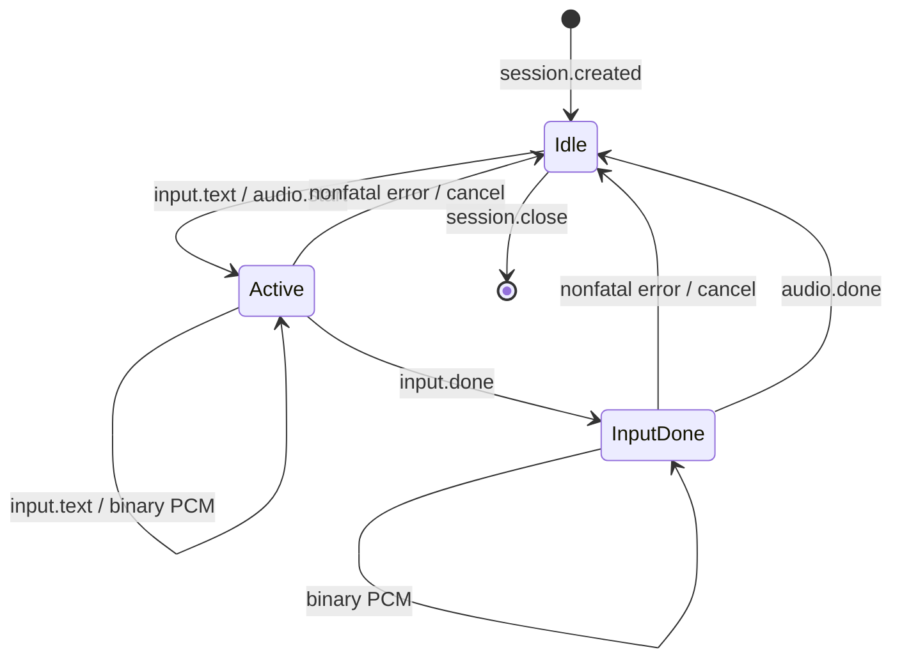

# TTS 双向流式 WebSocket 契约

公开地址为 `wss://{gpu_host}:8443/tts/v1/realtime`。CPU Web 后端在握手头中发送
`Authorization: Bearer <GPU_API_KEY>`；key 不得放入 URL、查询参数或浏览器。网关验证统一公开
key 后，以 TTS 内部 key 访问 `127.0.0.1:8004/realtime`。成功握手为 HTTP 101；错误公开 key
返回 401，已有连接占用唯一并发槽时返回 429，上游未就绪通常返回 502 或 504。

服务固定使用模型 `fun-cosyvoice3-0.5b-2512`、音色 `aishell3-female` 和速度 1.0。音色参考来自
AISHELL-3 的 Apache-2.0 女声 SSB0005，服务端启动时注册，客户端不能传音色、参考音频、指令、
模型名或速度。音频是 24000 Hz、单声道、little-endian `pcm_s16le`；二进制帧边界没有声学或
播放器层面的业务含义，应作为同一 utterance 的连续字节流处理。

## 服务端初始事件

连接建立后，服务端首先发送 JSON 文本帧：

```json
{
  "type": "session.created",
  "session_id": "tts_0123456789abcdef01234567",
  "model": "fun-cosyvoice3-0.5b-2512",
  "voice": "aishell3-female",
  "audio": {
    "format": "pcm_s16le",
    "sample_rate_hz": 24000,
    "channels": 1
  }
}
```

收到其他首帧、二进制首帧或不匹配的音频元数据时，客户端必须关闭连接。

## 客户端事件

客户端事件均为 UTF-8 JSON 文本帧，且对象不能带未定义字段。

追加文本并在空闲连接上开始一个 utterance：

```json
{"type":"input.text","text":"欢迎使用，"}
```

同一 utterance 可继续发送多个 `input.text`。服务端将非空文本去除首尾空白后按顺序交给模型；
文本不得包含 NUL、`<|` 或 `<endofprompt>` 控制序列。每个文本块最多 1024 个 Unicode 字符，
单个 utterance 合计最多 4096 个字符。

结束当前 utterance 的文本输入：

```json
{"type":"input.done"}
```

`input.done` 只结束当前文本生成器，不关闭 WebSocket。它只能在至少一个 `input.text` 之后发送；
发送后必须等待匹配的 `audio.done`，再开始下一条 utterance。

在两个 utterance 之间正常关闭会话：

```json
{"type":"session.close"}
```

服务端以 WebSocket close code 1000 关闭。活跃 utterance 中发送 `session.close` 会得到
`invalid_state`，不会立即中断模型。

## 服务端音频和控制事件

接受首个 `input.text` 后，服务端发送：

```json
{"type":"audio.start","utterance_id":"utt_0123456789abcdef01234567"}
```

随后发送零个或多个二进制 PCM 帧。模型严格双向流式消费文本生成器，因此首个二进制帧可以在
客户端发送 `input.done` 前到达。客户端必须同时发送文本和接收音频，不能先缓存完整文本。

模型完成且客户端已经发送 `input.done` 后，服务端发送：

```json
{"type":"audio.done","utterance_id":"utt_0123456789abcdef01234567"}
```

`audio.done` 是该 utterance 完整结束的唯一成功标志；连接断开或仅收到部分 PCM 不表示成功。
`utterance_id` 必须与前面的 `audio.start` 一致。收到 `audio.done` 后，同一连接可顺序发送下一条
`input.text`，服务端会分配新的 `utterance_id`。

## 错误事件

协议和推理错误使用 JSON 文本帧：

```json
{
  "type": "error",
  "code": "invalid_state",
  "message": "messages are not allowed after input.done",
  "fatal": false
}
```

当前错误码包括：

| code | 含义 | fatal |
| --- | --- | --- |
| `invalid_json` | 文本帧不是有效 JSON | false |
| `invalid_message` | 帧类型、对象字段或事件类型不符合契约 | false |
| `invalid_text` | 文本为空或含控制序列 | false |
| `input_chunk_too_long` | 单个文本块超过 1024 字符 | false |
| `input_too_long` | utterance 合计超过 4096 字符；服务端取消当前 utterance | false |
| `invalid_state` | 事件不适用于当前状态 | false |
| `input_backpressure` | 有界文本队列在 30 秒内不能接收新块 | false |
| `output_timeout` | 向客户端发送 PCM 或控制帧持续阻塞超过 30 秒 | true |
| `message_too_large` | 单个 WebSocket 文本消息超过 16384 字节 | false |
| `input_timeout` | 活跃 utterance 等待后续文本超过 300 秒 | true |
| `inference_failed` | 模型或输出处理失败 | true |

空闲状态的 `fatal=false` 错误不改变状态；活跃状态的 `fatal=false` 错误会取消当前 utterance，
清理生成器并回到空闲状态，不再发送该 utterance 的 `audio.done`，客户端可开始下一条。
`fatal=true` 后服务端使用 close code 1011 关闭连接。服务端错误不包含输入文本、
参考音频路径、内部 key 或堆栈。

## 状态和资源限制



网关和 TTS 服务都只允许 1 个活跃 WebSocket。单消息上限为 16384 字节；文本桥接队列最多 16
个块，写入等待上限为 30 秒。活跃 utterance 等待文本的上限为 300 秒，空闲会话等待下一事件的
上限为 3600 秒，单个 PCM 或控制帧发送上限为 30 秒，网关读写空闲超时是 3600 秒。PCM
输出已经超时时，服务端不再尝试向同一背压连接写错误帧；错误帧和关闭握手最多各等待 5 秒，
随后释放唯一并发槽。客户端断开时
服务端取消文本输入并排空厂商
生成器以释放缓存，在清理完成前并发槽不会释放。

## 监控口径

内部 `/metrics` 暴露 `tts_time_to_first_token_seconds`。每个 utterance 最多记录一次：起点是
`inference_bistream` 开始消费首批规范化文本 token，终点是首个语音 token 在 GPU 服务进程
可见。它排除等待客户端追加文本、文本队列等待、PCM 解码、网络和播放器缓冲，不等于 CPU
收到首个二进制帧或用户听到声音的延迟。内部 `/health` 与 `/metrics` 使用 TTS 内部 key 且仅
监听 loopback；统一网关不公开这些 HTTP 路径。
