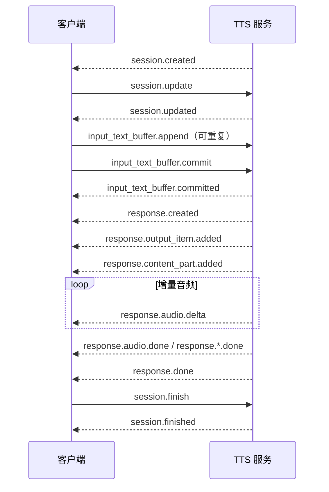

# Qwen-TTS Realtime API WebSocket 协议研究

调研日期：2026-09-15。本文只依据阿里云百炼官方文档，目的是为本项目设计 TTS WebSocket
接口提供协议参考，不代表本项目已经实现该协议。

## 结论

Qwen-TTS Realtime API 支持在一个 WebSocket 会话内持续追加文本并流式接收音频。它有两种模式：

- `server_commit`：客户端持续发送 `input_text_buffer.append`，服务端自行决定分段和合成时机；
  也可发送 `input_text_buffer.commit` 强制立即合成当前缓冲区。适合上游 LLM 持续产生文本的场景。
- `commit`：客户端发送一次或多次 `input_text_buffer.append` 后，必须发送
  `input_text_buffer.commit` 才开始本轮合成。适合 Web 后端已经按句切分并希望精确控制边界的场景。

官方将这两种模式分别定位为连续大段文本和逐轮合成，并明确说明 `server_commit` 客户端只需持续追加
文本。[实时语音合成：交互模式](https://help.aliyun.com/zh/model-studio/realtime-tts-user-guide)

Qwen-TTS 的客户端事件集合是 `session.update`、`input_text_buffer.append`、
`input_text_buffer.commit`、`input_text_buffer.clear` 和 `session.finish`。当前官方 TTS 客户端事件参考
**没有定义** `response.create` 或 `response.cancel`；`response.created` 是提交文本后由服务端下发的事件。
这与 Qwen-Omni/Qwen-Audio Realtime 协议不同，设计本项目接口时不应混用两套事件。
[客户端事件参考](https://help.aliyun.com/zh/model-studio/qwen-tts-realtime-client-events)
[服务端事件参考](https://help.aliyun.com/zh/model-studio/qwen-tts-realtime-server-events)

## 连接与鉴权

模型通过 URL 查询参数选择，WebSocket 必须使用 `wss://`：

```text
华北 2（北京） wss://dashscope.aliyuncs.com/api-ws/v1/realtime?model=qwen3-tts-flash-realtime
新加坡         wss://dashscope-intl.aliyuncs.com/api-ws/v1/realtime?model=qwen3-tts-flash-realtime
```

握手请求必须带 `Authorization: Bearer <api_key>`。可选请求头包括 `user-agent` 和
`X-DashScope-WorkSpace`；API Key 缺失或无效会在握手阶段返回 HTTP 401/403。
[WebSocket API：端点与请求头](https://help.aliyun.com/zh/model-studio/interactive-process-of-qwen-tts-realtime-synthesis)

连接建立后，服务端先下发 `session.created`，其中包含 `session.id` 以及当前的模型、音色、模式、
音频格式和采样率。客户端随后应立即发送 `session.update`；不发送时使用服务端默认配置。更新成功
由 `session.updated` 确认，参数错误则返回 `error`。
[客户端 `session.update`](https://help.aliyun.com/zh/model-studio/qwen-tts-realtime-client-events)
[服务端会话事件](https://help.aliyun.com/zh/model-studio/qwen-tts-realtime-server-events)

## 会话配置

每个客户端事件都必须包含在本次 WebSocket 会话中唯一的 `event_id`，官方建议使用 UUID。
典型配置事件如下：

```json
{
  "event_id": "event_123",
  "type": "session.update",
  "session": {
    "voice": "Cherry",
    "mode": "server_commit",
    "language_type": "Chinese",
    "response_format": "pcm",
    "sample_rate": 24000,
    "instructions": "",
    "optimize_instructions": false
  }
}
```

`session.update` 可配置以下字段。可用性会随模型系列变化：

| 字段 | 语义与官方约束 |
| --- | --- |
| `voice` | 会话使用的系统音色或专属音色 ID；支持哪类音色取决于所选模型。 |
| `mode` | `server_commit`（默认）或 `commit`。 |
| `language_type` | 默认 `Auto`，也可明确指定中文、英文、德语、意大利语、葡萄牙语、西班牙语、日语、韩语、法语或俄语。 |
| `response_format` | `pcm`（默认）、`wav`、`mp3` 或 `opus`；旧版 Qwen-TTS-Realtime 只支持 `pcm`。 |
| `sample_rate` | 8000、16000、24000（默认）或 48000 Hz；旧版 Qwen-TTS-Realtime 只支持 24000 Hz。 |
| `speech_rate` | 默认 1.0，范围 `[0.5, 2.0]`；旧版 Qwen-TTS-Realtime 不支持。 |
| `volume` | 默认 50，范围 `[0, 100]`；旧版 Qwen-TTS-Realtime 不支持。 |
| `pitch_rate` | 默认 1.0，范围 `[0.5, 2.0]`；旧版 Qwen-TTS-Realtime 不支持。 |
| `bit_rate` | 仅用于 Opus，默认 128 kbps，范围 `[6, 510]`；旧版 Qwen-TTS-Realtime 不支持。 |
| `instructions` | 仅 Qwen3-TTS-Instruct-Flash-Realtime 支持；中英文，不超过 1600 Token。 |
| `optimize_instructions` | 仅指令模型支持，且只有设置 `instructions` 时才生效。 |

字段和模型差异来自百炼官方的
[`session.update` 参数表](https://help.aliyun.com/zh/model-studio/qwen-tts-realtime-client-events)。

## 文本缓冲区与响应

持续追加文本：

```json
{
  "event_id": "event_append_1",
  "type": "input_text_buffer.append",
  "text": "您好，我是千问。"
}
```

在 `server_commit` 模式下，文本进入服务端缓冲区，服务端自动判断何时合成。在 `commit` 模式下，
文本保留在输入缓冲区，客户端用以下事件提交：

```json
{
  "event_id": "event_commit_1",
  "type": "input_text_buffer.commit"
}
```

空缓冲区执行 `commit` 会产生错误。服务端先确认 `input_text_buffer.committed`，然后自动下发
`response.created` 并开始生成；客户端无需再发 `response.create`。
[append、commit 与 clear 语义](https://help.aliyun.com/zh/model-studio/qwen-tts-realtime-client-events)
[响应创建事件](https://help.aliyun.com/zh/model-studio/qwen-tts-realtime-server-events)

尚未提交或尚未被服务端消费的缓冲文本可清除：

```json
{
  "event_id": "event_clear_1",
  "type": "input_text_buffer.clear"
}
```

服务端以 `input_text_buffer.cleared` 确认。官方只将该事件定义为“清除缓冲区中的文本”，没有说明它
会取消正在生成或已经返回的音频。因此实现播放打断时不能把 `clear` 当作 `response.cancel`。
[客户端 `input_text_buffer.clear`](https://help.aliyun.com/zh/model-studio/qwen-tts-realtime-client-events)

## 服务端事件

官方服务端事件按用途可整理为：

| 阶段 | 事件 | 作用 |
| --- | --- | --- |
| 错误 | `error` | 返回错误码和错误消息。 |
| 会话 | `session.created` | 连接成功及默认会话配置。 |
| 会话 | `session.updated` | `session.update` 生效确认。 |
| 输入 | `input_text_buffer.committed` | 文本缓冲区提交确认。 |
| 输入 | `input_text_buffer.cleared` | 文本缓冲区清除确认。 |
| 响应 | `response.created` | 服务端已创建一次合成响应，含 `response.id` 和所用 `voice`。 |
| 响应 | `response.output_item.added` | 创建输出消息项。 |
| 响应 | `response.content_part.added` | 创建音频内容部分。 |
| 音频 | `response.audio.delta` | Base64 编码的增量音频。 |
| 完成 | `response.audio.done` | 本次音频生成完成。 |
| 完成 | `response.content_part.done` | 音频内容部分完成。 |
| 完成 | `response.output_item.done` | 输出消息项完成。 |
| 完成 | `response.done` | 整次响应完成，包含状态、输出元数据及用量，不重复携带原始音频。 |
| 会话 | `session.finished` | 全部响应完成，会话结束。 |

各字段的完整定义见[服务端事件参考](https://help.aliyun.com/zh/model-studio/qwen-tts-realtime-server-events)。

一次常见的 `commit` 模式时序为：



## 音频传输

服务端通过 WebSocket 文本消息中的 `response.audio.delta` 字段传输 Base64 编码的增量音频，客户端
应逐块解码并按顺序播放或写入文件。音频编码由 `session.update` 中的 `response_format` 和
`sample_rate` 决定。[WebSocket 交互流程](https://help.aliyun.com/zh/model-studio/interactive-process-of-qwen-tts-realtime-synthesis)
[音频增量事件](https://help.aliyun.com/zh/model-studio/qwen-tts-realtime-server-events)

官方 SDK 示例将 PCM 配置表示为 `PCM_24000HZ_MONO_16BIT`，即 24 kHz、单声道、16 bit PCM。
[实时语音合成 SDK 示例](https://help.aliyun.com/zh/model-studio/realtime-tts-user-guide)
对于 WAV、MP3 和 Opus，客户端应把连续 delta 解码后的字节按所选格式连续消费；不能将每条
`response.audio.delta` 当作独立音频文件。

## 结束、取消与连接寿命

客户端用 `session.finish` 表示不再输入文本。服务端会返回剩余音频，发送 `session.finished`，随后
关闭连接。[客户端 `session.finish`](https://help.aliyun.com/zh/model-studio/qwen-tts-realtime-client-events)

当前 Qwen-TTS 客户端事件规范没有 `response.cancel`，也没有给出在同一会话中取消“正在生成的本轮
响应”的等价事件。若本项目需要“立即停止播报”，建议在自有协议中明确区分：

1. 停止本地播放并丢弃已排队音频；
2. 清除尚未提交的文本；
3. 终止 GPU 端当前生成任务。

第 3 项是本项目需要自行实现的会话能力，不能直接声称与百炼 Qwen-TTS 事件一一兼容。

百炼的通用生产说明还写明：任务结束后 60 秒没有新任务，连接会自动断开；任务失败时服务端返回
错误事件并关闭连接。[连接复用和空闲超时](https://help.aliyun.com/zh/model-studio/realtime-tts-user-guide)
这里与 Qwen-TTS 客户端事件页中“`session.finish` 后关闭连接”的表述并不完全一致。设计本项目时
应采用更严格的行为：收到 `session.finished` 后认为该连接已结束，不依赖 60 秒复用窗口。官方 TTS
协议资料没有公布单个尚在进行中的 Qwen-TTS 会话最大持续时长，也不应套用 Qwen-Omni Realtime
的会话时长限制。

## 已公开限制

- `event_id` 在单次 WebSocket 会话中必须唯一，官方建议 UUID。
- `instructions` 仅适用于 Qwen3-TTS-Instruct-Flash-Realtime，限中英文和 1600 Token。
- `qwen3-tts-flash-realtime` 当前模型页没有给出最大输入、最大输出或上下文长度，均标记为 `—`；
  因此不能从官方资料推导单次 `append` 或整场会话的最大文本字符数。
  [模型信息与上下文限制](https://help.aliyun.com/zh/model-studio/qwen3-tts-flash-realtime)
- 截至调研日期，稳定版 `qwen3-tts-flash-realtime`、
  `qwen3-tts-instruct-flash-realtime` 等当前版本为 180 RPM；旧版
  `qwen-tts-realtime` 为 10 RPM 和 100,000 TPM。具体快照和地域存在差异，应按实际选定模型核对。
  [百炼模型限流](https://help.aliyun.com/zh/model-studio/rate-limit)
- 通用生产说明给出任务后 60 秒空闲断连；Qwen-TTS 事件页则要求把 `session.finished` 视为连接结束。
  客户端必须实现断线检测和重新握手。

## 音色一致性的边界

`voice` 是会话级配置，`session.updated` 会回显生效的音色，`response.created` 和 `response.done`
也包含本轮所用 `voice`。因此，一个会话固定一次 `voice`，可以在协议层保证每轮都请求同一个音色
ID。[会话和响应事件字段](https://help.aliyun.com/zh/model-studio/qwen-tts-realtime-server-events)

`instructions` 可以控制音调、语速、情感和音色特点，因此稳定播报场景还应在会话内固定或省略
`instructions`。[指令控制](https://help.aliyun.com/zh/model-studio/realtime-tts-user-guide)

官方资料没有承诺同一 `voice` 在多次提交、不同句子或多次采样间达到某个声纹相似度，也没有公布
“同一 WebSocket 会话比多个 HTTP 请求更稳定”的指标。固定 WebSocket 会话和 `voice` 可以避免
业务代码误切换音色，但不能单凭协议证明模型输出不会产生音色漂移。

对本项目现有 CosyVoice-300M-Instruct 而言，把 HTTP 入口改为 WebSocket 只改变传输和会话管理；
如果每次提交仍独立执行当前随机采样的 `inference_instruct()`，音色漂移不会因此自动消失。要验证
改造效果，仍需固定合成模式、音色条件和随机策略，并对同会话多段输出进行声纹相似度测试。

## 本地 CosyVoice v1 的兼容子集

结合当前服务实现，首版适合实现“Qwen-TTS 风格、`commit` 模式”的协议子集。它能满足建立一次
连接、持续追加文本、逐轮提交并流式播放，但不应宣称完整兼容百炼 Qwen-TTS Realtime API。

| 能力 | 首版兼容方式 | 本地明确限制 |
| --- | --- | --- |
| WebSocket 建连 | 新增 `/tts/v1/realtime`，握手使用现有统一 Bearer API Key。 | 当前 Gateway 和 TTS 只注册了 HTTP speech 路由，必须新增 WebSocket 路由和反向代理配置。 |
| `session.update` | 接受一次初始配置，并以 `session.updated` 回显最终配置。 | `model` 固定 `cosyvoice-300m-instruct`；`voice` 仅限现有 7 个预置音色；`response_format` 固定 `pcm`；采样率固定 22050 Hz；`speed` 固定 1.0。 |
| `input_text_buffer.append` | 将多个文本片段按顺序追加到会话缓冲区。 | 一个待提交缓冲区最多 2000 个 Unicode 字符，并拒绝现有契约禁止的分词器控制序列。必须另设单条 WebSocket 消息大小和会话排队上限。 |
| `input_text_buffer.commit` | 把当前缓冲区作为一次 `inference_instruct(..., stream=True)` 调用，服务端自动产生 `response.created` 和音频事件。 | 同一时刻全服务只能执行 1 次模型推理。一次会话也只允许 1 个 response 处于生成状态；后续 commit 应排队或返回明确错误，不能并行推理。 |
| `input_text_buffer.clear` | 清除尚未 commit 的文本并返回 `input_text_buffer.cleared`。 | 无法撤回已经交给模型的文本，也无法停止已开始的推理。 |
| `response.audio.delta` | 把现有模型产生的每段 PCM 封装为 Base64 JSON delta。 | 音频是 22050 Hz、单声道、PCM S16LE，不是百炼示例的 24000 Hz；Base64 还会增加约三分之一传输体积。 |
| 多轮会话 | 一个连接内可重复 append → commit → response.done，且固定同一份会话配置。 | 每个 commit 都是独立模型调用；CosyVoice v1 没有跨 commit 的声学状态或说话人连续性接口。 |
| `server_commit` | 首版不支持，`session.update.mode` 只接受 `commit`。 | 当前模型封装没有自动断句器；需要先定义标点、最大等待时间和最大缓冲长度，才能可靠实现服务端自动提交。 |
| 取消 | 首版可定义“客户端停止接收/播放”，但不能承诺 GPU 立即停止。 | CosyVoice v1 没有计算取消接口；当前 HTTP 实现断开后仍会在后台排空生成器并释放缓存和并发槽。Qwen-TTS 官方客户端事件也没有 `response.cancel`。 |
| `session.finish` | 等待当前 response 完成；若缓冲区仍有文本，可先隐式 commit，最后返回 `session.finished` 并关闭连接。 | 隐式 commit 是否启用必须写进本项目契约，不能依赖客户端猜测。异常断线时仍需后台排空正在运行的生成器。 |

这些限制来自当前本地配置和实现：模型服务固定 22050 Hz PCM、2000 字符输入、500 字符指令、
7 个预置音色以及全局并发 1；合成始终调用 `inference_instruct()`，客户端断开后仍排空生成器。
[本地 TTS 配置](../config/server.json)
[本地 TTS 服务实现](../scripts/server.py)
[当前 OpenAPI TTS 契约](../../contracts/openapi.yaml)

这个子集中的 WebSocket 会话只持久化“配置和待合成文本”，不会持久化模型生成状态。若 CPU 后端在
一个会话内频繁 commit 短句，GPU 端仍会为每句重新调用 `inference_instruct()`，现有音色漂移仍可能
发生。要获得同一次模型生成内部最强的连续性，应尽量把相关文本合并到一次 commit；要从根本上提高
跨 commit 音色稳定性，则需另行改变合成模式或模型采样策略，并用声纹指标验证。

## 对本项目接口设计的直接启示

可以参考 Qwen-TTS 的会话结构实现 `/tts/v1/realtime`：连接时用统一 Gateway API Key 鉴权，
`session.update` 固定音色和 PCM 参数，CPU Web 后端持续发送 `input_text_buffer.append`，GPU 端用
`response.audio.delta` 返回 Base64 PCM。首版只实现 `commit` 能复用现有完整文本推理路径；如果
后续补齐可靠的自动断句和排队策略，再开放 `server_commit`。

本项目还应显式增加百炼 Qwen-TTS 当前没有定义的取消语义，或者明确首版不支持取消。无论采用哪种
选择，都应规定：单会话是否只允许一个正在生成的 response、append 与生成能否并行、背压上限、
最大缓冲文本、空闲超时、断线后的恢复方式，以及取消后哪些音频必须丢弃。这些都是本地服务契约，
不能从百炼协议自动继承。
